# Stress Test Results
Please find stress test to give rough idea on performance of both approach  below

##Test 1
**Users** :50 \
**Rate**: 10 steps \
**Runtime**: 2 mins \
**API Type**: Optimized \
**Avg Speed**: 0.345951 ms\
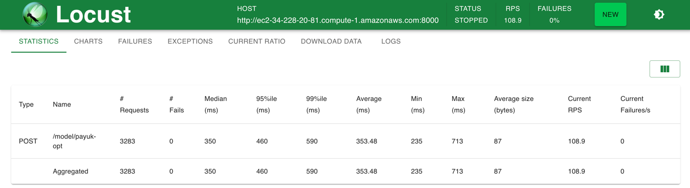
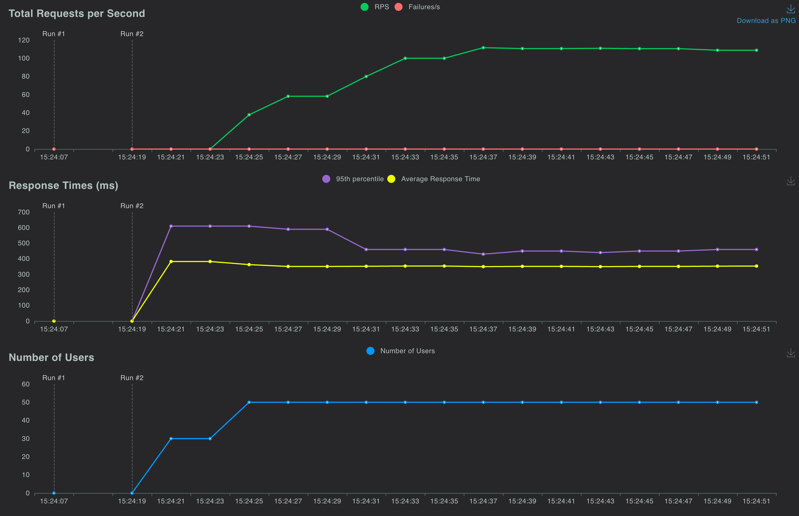

**Users** :50 \
**Rate**: 10 steps \
**Runtime**: 2 mins \
**API Type**: unoptimized \
**Avg Speed**: 1.417936 ms \
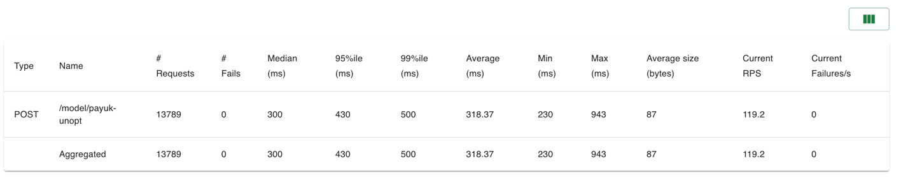
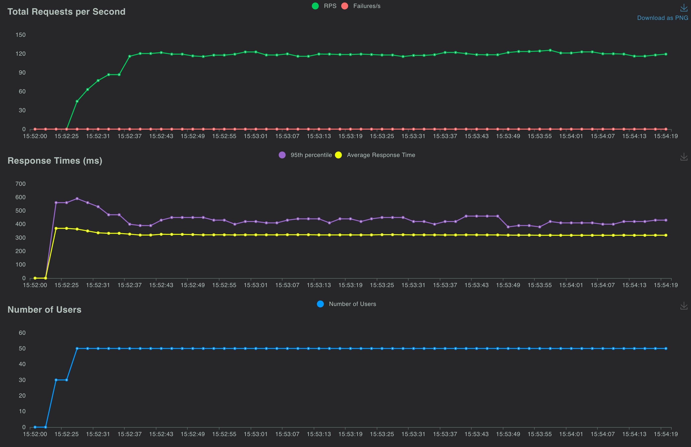

##Test 2
**Users** :100 \
**Rate**: 10 steps \
**Runtime**: 2 mins \
**API Type**: Optimized \
**Avg Speed**: 0.402301 ms \
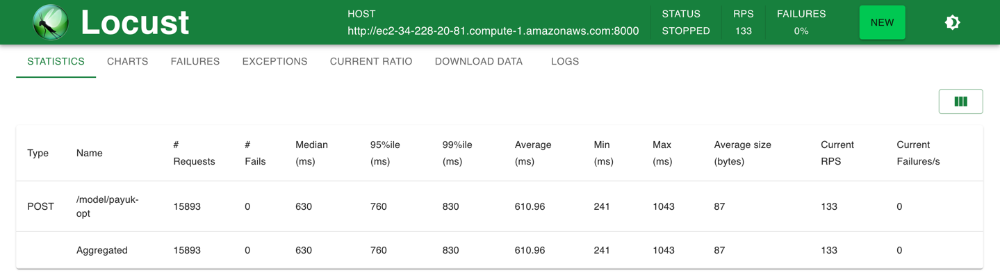
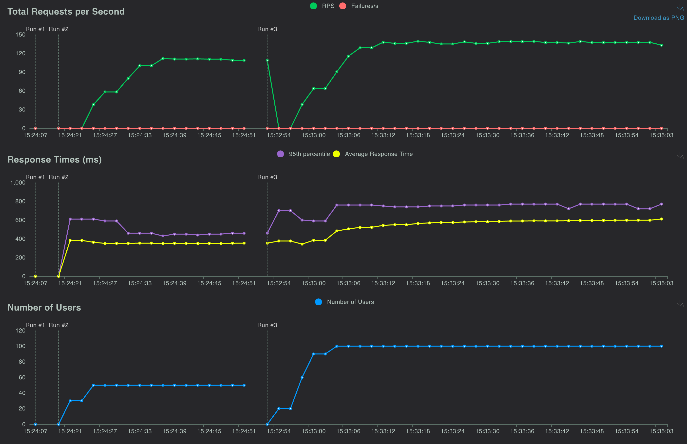

**Users** :100 \
**Rate**: 10 steps \
**Runtime**: 2 mins \
**API Type**: unoptimized \
**Avg Speed**: 1.417936 ms \
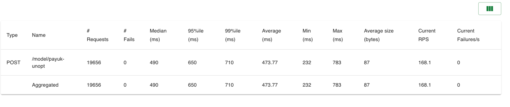
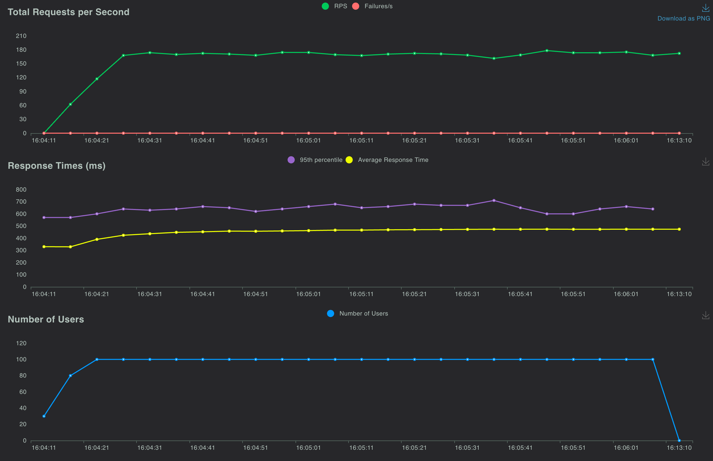

##Test 3
**Users** :150 \
**Rate**: 10 steps \
**Runtime**: 2 mins \
**API Type**: Optimized \
**Avg Speed**: 1.294660 ms \
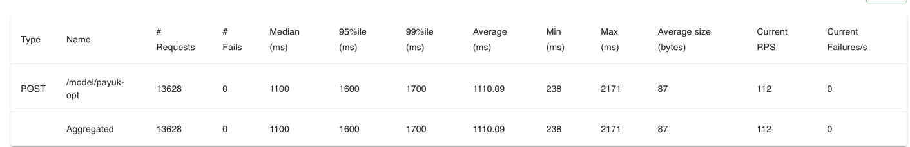
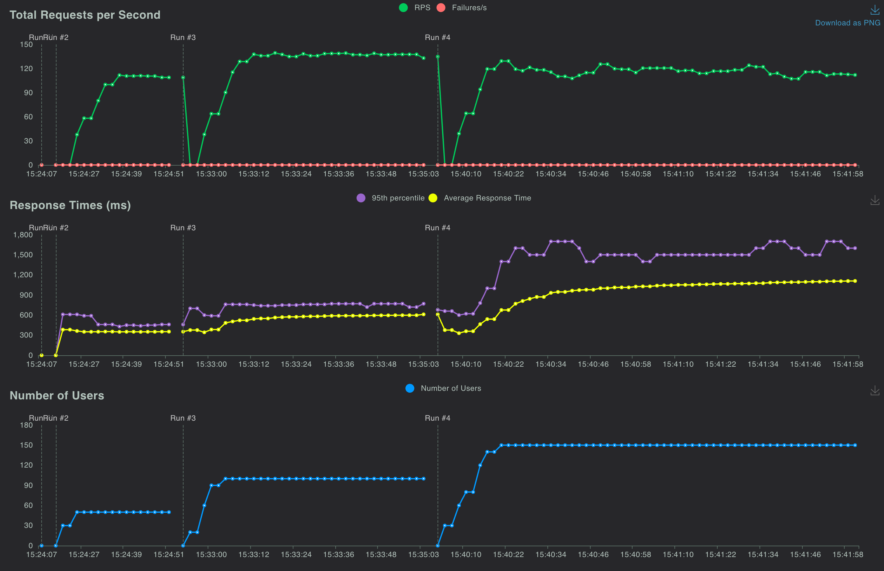

**Users** :150 \
**Rate**: 10 steps \
**Runtime**: 2 mins \
**API Type**: unoptimized \
**Avg Speed**: 2.786959 ms \
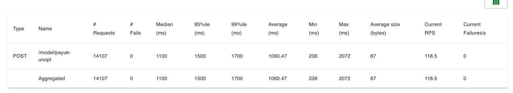
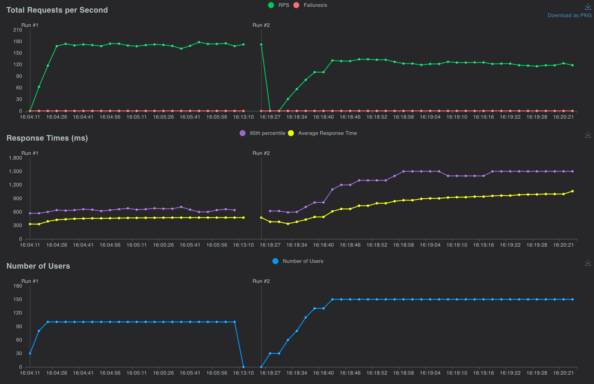